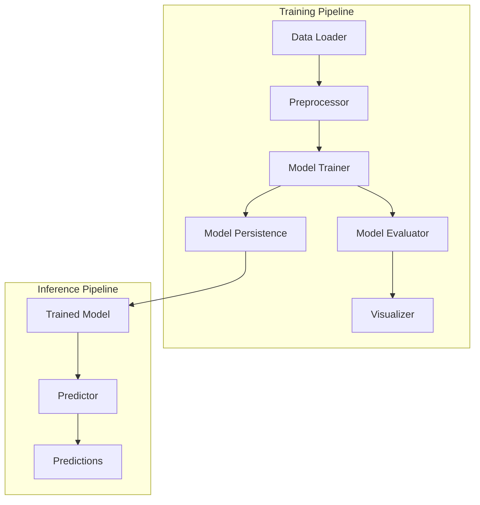

# Design Document

## Overview

本项目设计一个基于XGBoost的机器学习管道，用于预测CFST（钢管混凝土）柱的极限承载力。设计遵循模块化原则，将数据加载、预处理、模型训练、评估、预测和可视化功能分离为独立组件，构建一个可扩展、可维护的多截面统一预测系统。

## Steering Document Alignment

### 技术架构原则
- **模块化设计**: 每个组件有单一职责，通过清晰的接口进行通信
- **配置驱动**: 使用配置文件管理模型参数、数据路径和训练设置
- **可重复性**: 确保模型训练过程可复现，支持版本控制
- **工程化实践**: 遵循ML工程最佳实践，包括数据验证、错误处理和日志记录

### 项目结构规范
```
cfst-xgboost-pipeline/
├── config/                    # 配置文件
│   └── config.yaml           # 主配置文件
│
├── data/                     # 数据目录
│   ├── raw/                  # 原始数据
│   ├── processed/            # 处理后数据
│   └── models/               # 保存的模型
│
├── src/                      # 源代码
│   ├── __init__.py
│   ├── data_loader.py        # 数据加载器
│   ├── preprocessor.py       # 数据预处理
│   ├── model_trainer.py      # 模型训练器
│   ├── evaluator.py          # 模型评估器
│   ├── predictor.py          # 预测器
│   ├── visualizer.py         # 可视化器
│   └── utils/                # 工具函数
│       ├── __init__.py
│       ├── logger.py         # 日志配置
│       └── metrics.py        # 评估指标
│
├── notebooks/                # Jupyter notebooks
│   └── analysis.ipynb        # 分析 notebook
│
├── tests/                    # 测试代码
│   ├── test_data_loader.py
│   ├── test_preprocessor.py
│   ├── test_model_trainer.py
│   └── test_evaluator.py
│
├── main.py                   # 主入口
├── train.py                  # 训练脚本
├── predict.py                # 预测脚本
└── requirements.txt          # 依赖包
```

## Code Reuse Analysis

### 现有组件利用
本项目为新建项目，无现有代码库可重用。但会利用以下开源库和最佳实践：

- **XGBoost**: 梯度提升框架，用于回归任务
- **Pandas**: 数据处理和分析
- **NumPy**: 数值计算
- **Scikit-learn**: 数据分割、交叉验证和评估指标
- **Optuna**: 超参数优化框架
- **Matplotlib/Seaborn**: 可视化图表
- **PyYAML**: 配置文件解析
- **Logging**: Python标准库，日志记录

### 集成点
- **数据输入**: 从CSV文件加载特征工程后的数据
- **模型输出**: 保存训练好的XGBoost模型（.pkl格式）
- **日志系统**: 记录训练过程、评估结果和错误信息
- **可视化**: 生成特征重要性图并保存

## Architecture

### 系统架构图


### 模块化设计原则
1. **单一文件职责**: 每个Python文件只负责一个具体功能
2. **组件隔离**: 数据加载、预处理、训练、评估、预测功能完全分离
3. **服务层分离**: 清晰的接口定义，组件间通过函数调用通信
4. **工具模块化**: 日志、指标计算等工具函数独立封装

## Components and Interfaces

### Component 1: Data Loader (data_loader.py)
- **Purpose**: 从CSV文件加载数据，识别特征列和标签列
- **接口**:
  - `load_data(file_path: str) -> Tuple[pd.DataFrame, pd.Series]`: 加载数据并返回特征和标签
  - `get_feature_names() -> List[str]`: 返回特征列名称列表
  - `get_target_name() -> str`: 返回标签列名称
- **依赖**: pandas, numpy
- **重用**: Python标准文件操作和pandas的CSV读取功能

### Component 2: Preprocessor (preprocessor.py)
- **Purpose**: 数据清洗、剔除指定列、处理缺失值
- **接口**:
  - `__init__(columns_to_drop: List[str])`: 初始化要剔除的列
  - `fit_transform(X: pd.DataFrame) -> pd.DataFrame`: 训练并转换数据
  - `transform(X: pd.DataFrame) -> pd.DataFrame`: 转换新数据
  - `get_remaining_features() -> List[str]`: 返回保留的特征列表
- **依赖**: pandas, numpy
- **重用**: scikit-learn的Transformer接口模式

### Component 3: Model Trainer (model_trainer.py)
- **Purpose**: XGBoost模型训练、交叉验证和超参数优化
- **接口**:
  - `__init__(params: Dict, use_optuna: bool = False)`: 初始化训练器
  - `train(X_train: pd.DataFrame, y_train: pd.Series) -> xgboost.XGBRegressor`: 训练模型
  - `cross_validate(X: pd.DataFrame, y: pd.Series, cv: int = 5) -> Dict`: 执行交叉验证
  - `optimize_hyperparameters(X: pd.DataFrame, y: pd.Series, n_trials: int = 100)`: 超参数优化
- **依赖**: xgboost, sklearn, optuna
- **重用**: XGBoost的Scikit-learn兼容API

### Component 4: Model Evaluator (evaluator.py)
- **Purpose**: 评估模型性能，计算各种指标
- **接口**:
  - `evaluate(y_true: np.ndarray, y_pred: np.ndarray) -> Dict[str, float]`: 评估预测结果
  - `calculate_rmse(y_true: np.ndarray, y_pred: np.ndarray) -> float`: 计算RMSE
  - `calculate_mae(y_true: np.ndarray, y_pred: np.ndarray) -> float`: 计算MAE
  - `calculate_r2(y_true: np.ndarray, y_pred: np.ndarray) -> float`: 计算R²
  - `calculate_mape(y_true: np.ndarray, y_pred: np.ndarray) -> float`: 计算MAPE
- **依赖**: sklearn.metrics, numpy
- **重用**: scikit-learn的标准评估指标

### Component 5: Predictor (predictor.py)
- **Purpose**: 使用训练好的模型进行预测
- **接口**:
  - `__init__(model_path: str)`: 加载保存的模型
  - `predict_single(features: Dict) -> float`: 单条记录预测
  - `predict_batch(features_df: pd.DataFrame) -> np.ndarray`: 批量预测
  - `predict_and_export(features_df: pd.DataFrame, output_path: str) -> None`: 预测并导出结果
- **依赖**: xgboost, pandas, numpy
- **重用**: joblib/pickle的模型加载机制

### Component 6: Visualizer (visualizer.py)
- **Purpose**: 生成特征重要性图和其他可视化
- **接口**:
  - `plot_feature_importance(model: xgboost.XGBRegressor, feature_names: List[str], output_path: str)`: 特征重要性图
- **依赖**: matplotlib, seaborn, xgboost
- **重用**: matplotlib的标准绘图API

### Component 7: Model Persistence (model_utils.py)
- **Purpose**: 模型和预处理器的保存与加载
- **接口**:
  - `save_model(model, preprocessor, feature_names: List[str], output_dir: str)`: 保存模型和元数据
  - `load_model(model_path: str) -> Tuple[xgboost.XGBRegressor, object, List[str]]`: 加载模型和元数据
- **依赖**: joblib, os, json
- **重用**: joblib的序列化机制

## Data Models

### Model Configuration (config.yaml)
```yaml
# 数据配置
data:
  file_path: "data/feature_parameters.csv"
  target_column: "K"
  columns_to_drop: ["b", "h", "r0", "t", "L", "lambda"]
  test_size: 0.2
  random_state: 42

# XGBoost参数
model:
  params:
    objective: "reg:squarederror"
    max_depth: 6
    learning_rate: 0.1
    n_estimators: 200
    subsample: 0.8
    colsample_bytree: 0.8
    random_state: 42
  use_optuna: false
  n_trials: 100

# 交叉验证
cv:
  n_splits: 5
  random_state: 42

# 路径配置
paths:
  model_output: "models/xgboost_model.pkl"
  preprocessor_output: "models/preprocessor.pkl"
  feature_importance_plot: "output/feature_importance.png"
  evaluation_report: "output/evaluation_report.json"
```

### Training Metadata (training_metadata.json)
```json
{
  "train_date": "2026-01-13T16:00:00",
  "model_type": "XGBRegressor",
  "feature_names": ["R", "fy", "fc", "e1", "e2", "r0/h", "b/t", "Ac", "As", "Re", "te", "ke", "xi", "sigma_re", "lambda_bar", "e/h", "e1/e2", "e_bar"],
  "target_column": "K",
  "train_samples": 400,
  "test_samples": 100,
  "cv_scores": {
    "mean_rmse": 150.5,
    "std_rmse": 12.3
  },
  "final_metrics": {
    "rmse": 145.2,
    "mae": 118.7,
    "r2": 0.9234,
    "mape": 0.085
  },
  "model_params": {
    "objective": "reg:squarederror",
    "max_depth": 6,
    "learning_rate": 0.1
  }
}
```

## Error Handling

### Error Scenarios

1. **文件不存在或格式错误**
   - **处理**: 捕获FileNotFoundError和ParserError，返回清晰错误信息
   - **用户影响**: 显示"数据文件不存在或格式错误，请检查文件路径"，程序退出

2. **列名不匹配**
   - **处理**: 验证所需的b, h, r₀, t, L, λ, K列是否存在
   - **用户影响**: 显示"缺少必要的列: [列名列表]"，程序退出

3. **数据预处理错误**
   - **处理**: 捕获数据转换异常，检查缺失值和异常值
   - **用户影响**: 显示"数据预处理失败，请检查数据质量"，输出详细错误日志

4. **模型训练失败**
   - **处理**: 捕获XGBoost训练异常，检查参数有效性
   - **用户影响**: 显示"模型训练失败: [错误信息]"，保存错误日志

5. **模型评估指标异常**
   - **处理**: 检查预测值和真实值的维度匹配
   - **用户影响**: 显示"评估失败: 预测结果格式错误"，要求重新运行评估

6. **模型文件损坏或不存在**
   - **处理**: 在加载模型时捕获PickleError和FileNotFoundError
   - **用户影响**: 显示"模型文件无效或不存在，请先训练模型"，指导用户运行训练脚本

7. **预测输入格式错误**
   - **处理**: 验证输入特征的数量和类型，与训练时保持一致
   - **用户影响**: 显示"预测输入格式错误: 期望18个特征，得到[N]个"，提供输入格式说明

## Testing Strategy

### Unit Testing
- **数据加载测试**: 测试CSV读取、列识别功能
- **预处理测试**: 测试列剔除、缺失值处理逻辑
- **训练测试**: 测试模型训练流程（使用小数据集）
- **评估测试**: 测试各项指标计算准确性
- **预测测试**: 测试单条和批量预测功能
- **模型保存/加载测试**: 测试序列化和反序列化

### Integration Testing
- **端到端训练流程**: 从数据加载到模型保存的完整流程
- **预测流程**: 加载模型→预处理→预测→结果导出
- **异常处理流程**: 模拟各种错误场景，验证错误处理

### End-to-End Testing
- **典型工程案例**: 使用真实的CFST柱数据训练模型
- **跨截面预测**: 验证模型在不同截面形状上的泛化能力
- **性能基准测试**: 评估训练时间和预测速度是否符合要求
