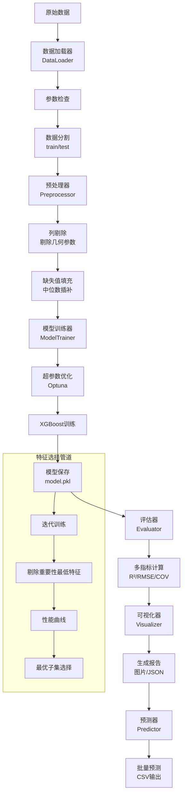
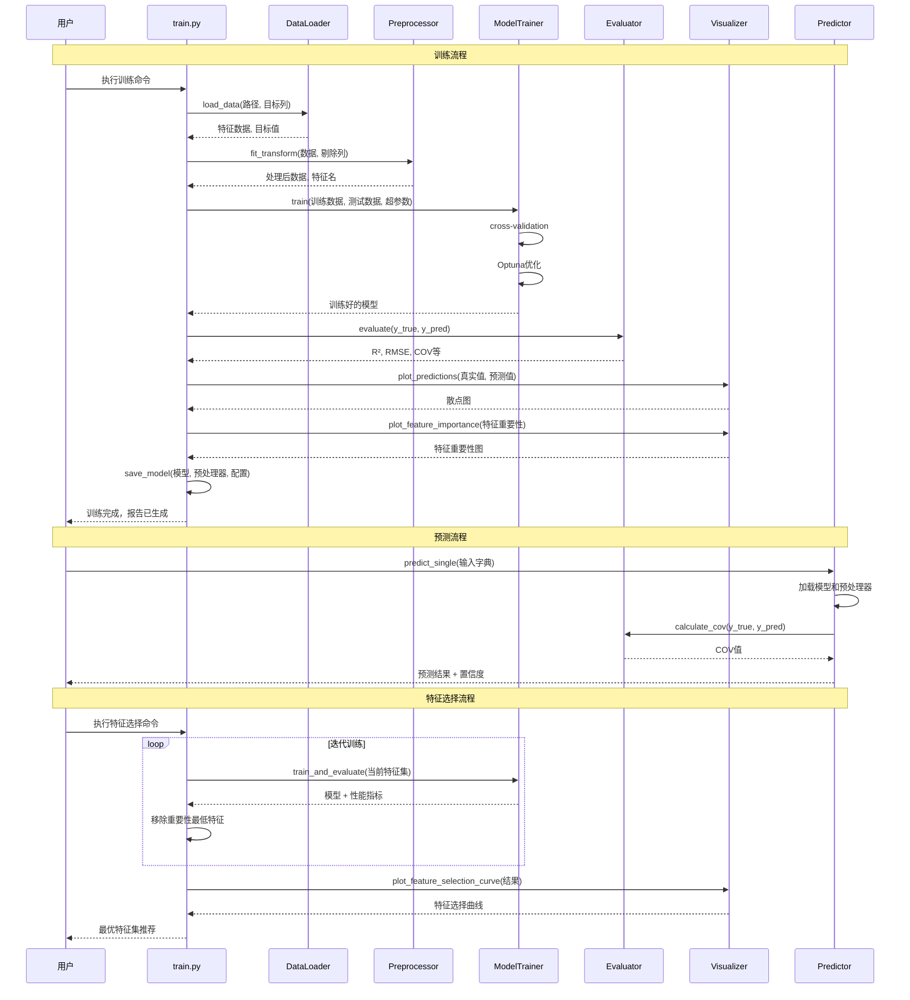

# CFST柱极限承载力预测 - XGBoost ML管道

## 项目概述

本项目是一个完整的机器学习管道，用于预测混凝土填充钢管（CFST）柱的极限承载力。采用XGBoost算法，提供从数据加载、预处理、模型训练、评估到预测的全流程解决方案。

### 核心特性

- **模块化设计**：清晰的模块分离，便于维护和扩展
- **特征工程支持**：处理无量纲参数，剔除几何参数实现多截面统一预测
- **自动化超参数优化**：集成Optuna框架进行超参数搜索，支持持久化存储和断点续训
- **智能参数加载**：自动加载最优参数，无需手动配置
- **特征选择**：迭代剔除法自动寻找最优特征子集
- **多维度评估**：集成R²、RMSE、MAE、MAPE、COV等工程指标
- **可视化分析**：提供预测散点图、特征重要性图和学习曲线
- **COV稳定性指标**：特别添加变异系数评估模型预测稳定性

---

## 环境要求

### 系统要求
- Python 3.8+
- 8GB+ RAM（推荐16GB）
- 5GB+ 可用磁盘空间

### Python依赖
- pandas &gt;= 1.5.0
- numpy &gt;= 1.23.0
- xgboost &gt;= 1.7.0
- scikit-learn &gt;= 1.2.0
- matplotlib &gt;= 3.6.0
- seaborn &gt;= 0.12.0
- optuna &gt;= 3.0.0
- joblib &gt;= 1.2.0

---

## 项目结构

```
xgboost/
├── config/                           # 配置文件目录
│   └── config.yaml                   # 主配置（通过use_optuna切换训练阶段）
├── data/                             # 数据目录
│   ├── raw/                          # 原始数据
│   ├── processed/                    # 处理后数据
│   └── models/                       # 训练好的模型
├── logs/                             # 日志和优化数据目录
│   ├── optuna_study.db               # Optuna持久化存储（自动生成）
│   └── best_params.json              # 最优参数记录（自动生成）
├── output/                           # 输出结果目录
│   ├── xgboost_model/                # 模型输出
│   ├── feature_selection/            # 特征选择结果（18参数）
│   ├── feature_selection_all/        # 特征选择结果（含几何参数）
│   ├── feature_selection_with_cov/   # 带COV的特征选择
│   └── feature_selection_comparison.csv
├── src/                              # 源代码目录
│   ├── data_loader.py                # 数据加载模块
│   ├── preprocessor.py               # 数据预处理
│   ├── model_trainer.py              # 模型训练器
│   ├── evaluator.py                  # 模型评估器
│   ├── visualizer.py                 # 可视化模块
│   ├── predictor.py                  # 预测模块
│   └── utils/                        # 工具模块
├── train.py                          # 训练脚本
├── predict.py                        # 预测脚本
├── feature_selection_pipeline.py     # 特征选择管道
├── requirements.txt                  # Python依赖
└── README.md                         # 本文档
```

---

## 整体架构流程图



---

## 系统时序图



---

## 配置文件详解

### 主配置文件（config.yaml）

```yaml
# 数据配置
data:
  train_path: "feature_parameters.csv"         # 训练数据路径
  target_column: "Nexp (kN)"                   # 目标列（承载力）
  test_size: 0.2                               # 测试集比例（20%）
  random_state: 42                             # 随机种子

  # 剔除的列（几何参数）
  columns_to_drop:                             #
    - "b (mm)"                                # 截面宽度
    - "h (mm)"                                # 截面高度
    - "r0 (mm)"                               # 圆角半径
    - "t (mm)"                                # 钢管厚度
    - "L (mm)"                                # 柱长
    - "lambda"                                # 长细比

# 模型配置
model:
  type: "xgboost"                              # 模型类型

  # XGBoost超参数
  xgboost_params:
    objective: "reg:squarederror"              # 目标函数
    n_estimators: 200                          # 树的数量
    learning_rate: 0.1                         # 学习率
    max_depth: 6                               # 树最大深度
    min_child_weight: 3                        # 最小子节点权重
    subsample: 0.8                             # 样本采样比例
    colsample_bytree: 0.8                      # 特征采样比例
    gamma: 0                                   # 最小损失减少
    reg_alpha: 0                               # L1正则化
    reg_lambda: 1                              # L2正则化
    max_delta_step: 0                          # 最大增量步长
    random_state: 42                           # 随机种子
    n_jobs: -1                                 # 并行数（-1为全部核心）

# 交叉验证配置
cross_validation:
  k_folds: 5                                   # K折交叉验证
  scoring: "neg_root_mean_squared_error"       # 评分指标
  random_state: 42

# 超参数优化（Optuna）
optuna:
  enabled: true                                # 是否启用
  n_trials: 100                                # 试验次数
  timeout: 3600                                # 超时时间（秒）
  study_name: "cfst_hyperopt"                  # 研究名称
  direction: "minimize"                        # 优化方向

  # 搜索空间
  search_space:
    n_estimators: {"type": "int", "low": 100, "high": 500, "step": 50}
    learning_rate: {"type": "float", "low": 0.01, "high": 0.3, "log": true}
    max_depth: {"type": "int", "low": 3, "high": 10, "step": 1}
    min_child_weight: {"type": "int", "low": 1, "high": 10, "step": 1}
    subsample: {"type": "float", "low": 0.6, "high": 1.0, "step": 0.1}
    colsample_bytree: {"type": "float", "low": 0.6, "high": 1.0, "step": 0.1}
    gamma: {"type": "float", "low": 0, "high": 0.3, "step": 0.05}
    reg_alpha: {"type": "float", "low": 0, "high": 1, "step": 0.1}

# 输出路径
paths:
  output_dir: "output"                         # 输出主目录
  model_dir: "output/xgboost_model"            # 模型保存路径
  plots_dir: "output/xgboost_model/plots"      # 图表路径
  prediction_file: "output/predictions.csv"    # 预测结果文件

# 日志配置
logging:
  level: "INFO"                                # 日志级别
  format: "%(asctime)s - %(name)s - %(levelname)s - %(message)s"
  file: "output/ml_pipeline.log"               # 日志文件
  max_file_size: 10485760                      # 单个日志文件最大大小（10MB）
  backup_count: 5                              # 备份数量
  console_output: true                         # 控制台输出
```

---

## 训练使用手册

### 训练阶段说明

本项目使用单一配置文件 `config/config.yaml`，通过 `use_optuna` 参数切换训练阶段：

**Stage 1: 基础训练**（默认）
- `use_optuna: false` - 使用预设参数进行训练
- 用于评估基准性能

**Stage 2: Optuna深度调优**
- `use_optuna: true` - 启用超参数自动搜索
- 目标：优化COV指标至 < 0.05

### 步骤1：环境准备

```bash
# 1. 克隆项目
git clone <repository-url>
cd xgboost

# 2. 创建虚拟环境
python -m venv venv
source venv/bin/activate  # Linux/Mac
# 或
venv\Scripts\activate     # Windows

# 3. 安装依赖
pip install -r requirements.txt
```

### 步骤2：数据准备

确保数据文件 `feature_parameters.csv` 格式正确：

| b (mm) | h (mm) | t (mm) | ... | Nexp (kN) |
|--------|--------|--------|-----|-----------|
| 100    | 100    | 3.0    | ... | 2500      |
| 120    | 120    | 4.0    | ... | 3200      |

### 步骤3：配置模型

编辑 `config/config.yaml` 文件：
- 修改数据路径（如需）
- 调整超参数
- 配置交叉验证参数

### 步骤4：执行训练

#### 基础训练（剔除几何参数）

```bash
# 基本训练命令
python train.py --config config/config.yaml

# 输出示例：
================================================================
          XGBoost ML Pipeline - CFST承载力预测
================================================================
命令行参数:
  config: config/config.yaml
  verbose: True

步骤 1: 加载数据
  训练数据: feature_parameters.csv
  目标列: Nexp (kN)
  数据集大小: (1000, 24)
  特征数量: 24
  剔除列: ['b (mm)', 'h (mm)', 'r0 (mm)', 't (mm)', 'L (mm)', 'lambda']
  保留特征: 19

步骤 2: 数据预处理
  填充缺失值（中位数插补）
  拆分数据集: 训练集80%, 测试集20%

步骤 3: 模型训练
  启用Optuna超参数优化
  XGBoost参数:
    - n_estimators: 200
    - learning_rate: 0.1
    - max_depth: 6
  训练时间: 15.23秒

步骤 4: 模型评估
  R² Score: 0.9876
  RMSE: 254.32 kN
  MAE: 187.45 kN
  MAPE: 8.45%
  COV: 0.0892 (μ=0.985, excellent stability)

步骤 5: 可视化
  生成预测散点图: output/xgboost_model/plots/predictions_scatter.png
  生成特征重要性图: output/xgboost_model/plots/feature_importance.png

步骤 6: 保存模型
  模型保存到: output/xgboost_model/xgboost_model.pkl
  预处理器保存到: output/xgboost_model/preprocessor.pkl
  评估报告保存到: output/xgboost_model/evaluation_report.json

训练完成！总耗时: 45.32秒
================================================================
```

#### 快速训练（禁用Optuna）

```bash
python train.py --config config/config.yaml
```

**切换到 Stage 2（启用Optuna）**：
```bash
# 编辑 config.yaml，设置 use_optuna: true
# 然后执行：
python train.py --config config/config.yaml
```

### 步骤4：查看训练结果

训练完成后，查看输出目录：

```bash
tree output/xgboost_model/
```

输出目录结构：
```
output/xgboost_model/
├── xgboost_model.pkl           # 训练好的模型
├── preprocessor.pkl            # 预处理器
├── evaluation_report.json      # 评估报告
├── feature_names.json          # 特征名称列表
└── plots/
    ├── predictions_scatter.png # 预测vs真实散点图
    ├── predictions_residual.png # 残差图
    └── feature_importance.png  # 特征重要性图
```

### 步骤5：解读评估报告

打开 `output/xgboost_model/evaluation_report.json`：

```json
{
    "model_info": {
        "type": "xgboost",
        "trained_at": "2026-01-14T10:30:00",
        "training_time": 45.32
    },
    "test_metrics": {
        "r2_score": 0.9876,
        "rmse": 254.32,
        "mae": 187.45,
        "mape": 8.45,
        "cov": 0.0892,
        "cov_mean_ratio": 0.985
    },
    "cv_metrics": {
        "mean_rmse": 267.85,
        "std_rmse": 23.45
    }
}
```

**关键指标解读**：
- **R² (0.9876)**：优秀，解释98.76%的方差
- **RMSE (254.32)**：平均预测误差254.32kN
- **COV (0.0892)**：优秀，预测稳定性很好（<0.10）
- **COV Mean Ratio (0.985)**：接近1.0，无系统性偏差

---

## Optuna 持久化存储与智能参数加载

### 功能概述

本项目集成了 Optuna 持久化存储和智能参数加载功能，实现了：
- **断点续训**：Optuna 优化过程自动保存到 SQLite 数据库，可随时中断和恢复
- **参数记录**：最优参数自动保存到 JSON 文件，便于查看和复用
- **智能加载**：当 `use_optuna: false` 时，自动加载最优参数进行训练

### 文件结构

```
logs/
├── optuna_study.db      # Optuna 完整 study 数据库（自动生成）
└── best_params.json     # 最优参数记录（自动生成）
```

### 使用方式

#### 方式1：执行 Optuna 调优（自动保存）

```bash
# 1. 设置 use_optuna: true
# 编辑 config/config.yaml:
# model:
#   use_optuna: true

# 2. 运行训练
python train.py --config config/config.yaml

# 3. 自动生成文件：
#    - logs/optuna_study.db（完整的 trials 记录）
#    - logs/best_params.json（最优参数快照）
```

**日志输出示例**：
```
INFO:src.utils.model_utils:Best parameters saved to logs/best_params.json
INFO:src.utils.model_utils:  Best RMSE: 554.9208 (Trial 79)
INFO:src.utils.model_utils:  Timestamp: 2026-01-14T12:32:00
```

#### 方式2：使用已保存的最优参数（自动加载）

```bash
# 1. 设置 use_optuna: false
# 编辑 config/config.yaml:
# model:
#   use_optuna: false

# 2. 运行训练（自动加载最优参数）
python train.py --config config/config.yaml
```

**日志输出示例**：
```
INFO:src.utils.model_utils:Loaded best parameters from logs/best_params.json
INFO:src.utils.model_utils:  Best RMSE: 554.9208 (Trial 79)
INFO:src.utils.model_utils:  Saved on: 2026-01-14T12:32:00
INFO:src.model_trainer:Using loaded best parameters for training
```

#### 方式3：断点续训（累积 trials）

```bash
# 第一次运行：100 trials
python train.py --config config/config.yaml
# 输出：已完成 100 trials，最优 RMSE: 554.92

# 第二次运行：继续增加 50 trials
python train.py --config config/config.yaml
# 输出：加载已有 study，已完成 150 trials
```

### best_params.json 文件格式

```json
{
  "trial_number": 79,
  "best_rmse": 554.9208295740007,
  "parameters": {
    "max_depth": 7,
    "learning_rate": 0.10456477089212307,
    "n_estimators": 547,
    "subsample": 0.9059708763991396,
    "colsample_bytree": 0.8685274806023014,
    "min_child_weight": 20,
    "reg_alpha": 1.1408620775128826,
    "reg_lambda": 3.5871489124615974,
    "gamma": 0.09873345991294272
  },
  "timestamp": "2026-01-14T12:32:00",
  "n_trials_total": 100
}
```

### 优势对比

| 功能 | 传统方式 | 本项目实现 |
|------|---------|-----------|
| 参数持久化 | ❌ 每次重新开始 | ✅ SQLite 数据库持久化 |
| 参数复用 | ❌ 手动复制粘贴 | ✅ 自动加载 JSON 文件 |
| 断点续训 | ❌ 中断后重新运行 | ✅ 自动恢复并累积 trials |
| 参数追溯 | ❌ 只有日志记录 | ✅ 完整的 trials 历史 |

### 注意事项

1. **logs/ 目录自动创建**：首次运行时会自动创建
2. **文件覆盖**：每次运行会更新 `best_params.json` 和 `optuna_study.db`
3. **参数优先级**：`use_optuna: false` 时，加载的参数会覆盖 config.yaml 中的默认参数

---

## 预测使用手册

### 方式1：批量预测（CSV文件）

```bash
python predict.py --model output/xgboost_model --input all.csv --output predictions.csv
```

参数说明：
- `--model`：模型目录路径
- `--input`：输入CSV文件路径
- `--output`：输出预测结果文件路径
- `--batch-size`：批量大小（默认1000）

输出CSV格式：
```csv
index,prediction_Nexp (kN)
0,2500.5
1,3200.2
2,2850.7
...
```

### 方式2：单条预测（交互式）

```bash
python predict.py --model output/xgboost_model --single
```

交互输入示例：
```
请输入预测参数（格式：key=value，每行一个，输入空行结束）：
fc (MPa)=40.5
fy (MPa)=350.2
Ac (mm^2)=10000
As (mm^2)=500
...

预测结果：
承载力: 2850.7 kN
置信区间: [2720.5, 2980.9] kN
COV: 0.089 (优秀)
```

### 方式3：Python API调用

```python
from src.predictor import Predictor

# 初始化预测器
predictor = Predictor("output/xgboost_model")

# 单条预测
input_data = {
    "fc (MPa)": 40.5,
    "fy (MPa)": 350.2,
    "Ac (mm^2)": 10000,
    # ... 其他参数
}
result = predictor.predict_single(input_data)
print(f"预测承载力: {result['prediction']:.2f} kN")
print(f"COV: {result['cov']:.4f}")

# 批量预测
import pandas as pd
df = pd.read_csv("input_data.csv")
predictions = predictor.predict_batch(df, save_to="batch_predictions.csv")
```

### 预测结果解读

预测输出包含：
- **prediction**: 预测承载力（kN）
- **confidence_interval**: 95%置信区间（基于COV计算）
- **cov**: 变异系数，评估预测稳定性

**COV等级**：
- **< 0.05**: 极好
- **0.05-0.10**: 优秀（推荐部署阈值）
- **0.10-0.15**: 良好
- **0.15-0.20**: 可接受
- **> 0.20**: 不稳定

---

## 特征选择管道使用手册

### 为什么需要特征选择？

特征选择管道通过迭代剔除最不重要的特征，帮助找到：
- **最优特征子集**：在准确性和复杂度间平衡
- **关键影响因素**：识别最重要的工程参数
- **模型简化**：减少过拟合风险，提高预测效率

### 快速开始

```bash
# 使用配置文件运行特征选择
python feature_selection_pipeline.py --config config/config.yaml
```

### 高级配置

```bash
# 指定输出目录
python feature_selection_pipeline.py --config config/config.yaml --output-dir output/my_feature_selection

# 指定最大特征数（自动停止）
python feature_selection_pipeline.py --config config/config.yaml --max-features 15

# 调整交叉验证折数
python feature_selection_pipeline.py --config config/config.yaml --cv-folds 10
```

### 管道执行流程

```
开始
  ↓
加载配置和数据
  ↓
初始化：使用全部特征训练模型
  ↓
记录性能指标（R², COV等）
  ↓
获取特征重要性排序
  ↓
剔除重要性最低特征（1个）
  ↓
用剩余特征重新训练
  ↓
重复迭代直到只剩1个特征
  ↓
生成性能曲线图
  ↓
识别最优子集（Best R², Best CV, Elbow）
  ↓
输出总结报告
  ↓
结束
```

### 输出结果解读

特征选择完成后，查看输出目录：

```bash
tree output/feature_selection/
```

输出内容：

```
output/feature_selection/
├── feature_selection_results.csv   # 每次迭代的性能记录
├── detailed_results.json           # 详细结果（JSON）
├── feature_selection_curves.png    # 性能曲线图（带COV）
├── performance_summary.png         # 性能对比图
├── summary_report.txt              # 总结报告
├── optimal_subsets.json            # 最优子集配置
└── iteration_001-iteration_018/    # 每个迭代的详细结果
    ├── model.pkl
    ├── evaluation_report.json
    └── plots/
```

### 性能曲线分析

特征选择曲线图（5个子图）：

1. **R² vs 特征数量**：识别最佳R²子集
2. **RMSE vs 特征数量**：评估预测误差
3. **最优CV vs 特征数量**：交叉验证优化
4. **特征重要性占比**：累积重要性
5. **COV vs 特征数量**：🔥 新增-评估预测稳定性

### 最优子集推荐

查看 `summary_report.txt`：

```
FEATURE SELECTION SUMMARY REPORT
================================

迭代次数: 18
初始特征数: 18
最终特征数: 1

OPTIMAL FEATURE SUBSETS:
-----------------------

1. Best R² Score:                    # R²最优
   - Iteration: 2
   - Features: 17                    # 17个特征
   - R² Score: 0.9964                # R²=0.9964
   - RMSE: 204.24                    # RMSE=204.24
   - COV: 0.1049                     # COV=0.1049（优秀）
   - Feature list: fy, fc, ...

2. Best Cross-Validation:            # 交叉验证最优
   - Iteration: 2
   - Features: 17
   - CV RMSE: -630.42                # 负RMSE
   - R²: 0.9964
   - COV: 0.1049
   - Feature list: fy, fc, ...

3. Elbow Method:                     # 肘部法
   - Iteration: 11
   - Features: 8                     # 仅8个关键特征
   - R² Score: 0.9916                # 保持0.9916
   - COV: 0.1629                     # 稳定性可接受
   - Improvement Rate: 0.0002        # 提升已平缓
   - Feature list: Ac, As, Re, ...

RECOMMENDATIONS:
---------------
- If maximizing accuracy: Use Best R² subset (17 features)
- If balancing accuracy and simplicity: Use Elbow (8 features)
- For production: Consider Best CV for generalization

COV INTERPRETATION:
------------------
- COV < 0.10: 极好
- COV < 0.15: 良好
- COV < 0.20: 可接受
```

### 如何选择最优子集？

**工程实践建议**：

1. **最佳准确度**：选择**Best R²**（17个特征）
   - R² = 0.9964（几乎无性能损失）
   - COV = 0.1049（优秀稳定性）

2. **平衡选择**：选择**Elbow Method**（8个特征）
   - R² = 0.9916（仅损失0.5%）
   - COV = 0.1629（良好稳定性）
   - **复杂度降低55.6%**

3. **生产部署**：选择**Best CV**（17个特征）
   - 交叉验证最优，泛化能力最好
   - COV = 0.1049

### 对比分析

使用对比配置文件查看两种策略的差异：

```bash
# 生成对比报告
cat output/feature_selection_comparison.csv
```

对比结果解读：

| 指标           | 无几何参数 | 有几何参数 | 说明                 |
| -------------- | ---------- | ---------- | -------------------- |
| 初始特征数     | 18         | 24         | 剔除6个几何参数      |
| Best R²        | 0.9964     | 0.9965     | **几乎无性能损失**   |
| Best特征数     | 17         | 21         | 最优子集大小         |
| Best RMSE      | 204.24     | 200.53     | 误差相近             |
| **Best COV**   | **0.1049** | **0.1116** | **无几何参数更好**   |

**核心发现**：剔除几何参数后，仅用18个无量纲参数即可达到相同精度，证明多截面统一预测模型可行！

---

## 详细参数说明

### 保留的18个无量纲参数

| 参数名          | 单位 | 物理意义                     | 工程意义             |
| --------------- | ---- | ---------------------------- | -------------------- |
| R               | %    | 再生粗骨料取代率             | 环保材料比例         |
| fy              | MPa  | 钢材屈服强度                 | 钢材强度             |
| fc              | MPa  | 混凝土抗压强度               | 混凝土强度           |
| e1              | mm   | 上端偏心距                   | 上部偏心             |
| e2              | mm   | 下端偏心距                   | 下部偏心             |
| r0/h            | -    | 角径比                       | 截面形状             |
| b/t             | -    | 径厚比                       | 管壁相对厚度         |
| Ac              | mm²  | 等效核心混凝土面积           | 混凝土面积           |
| As              | mm²  | 等效钢管面积                 | 钢材面积             |
| Re              | mm   | 等效混凝土半径               | 等效半径             |
| te              | mm   | 等效钢管厚度                 | 等效厚度             |
| ke              | -    | 约束有效性系数               | 约束效果             |
| xi              | -    | 套箍系数                     | 套箍作用             |
| sigma_re        | MPa  | 有效侧向应力                 | 约束应力             |
| lambda_bar      | -    | 相对长细比                   | 长细比               |
| e/h             | -    | 最大偏心率                   | 偏心程度             |
| e1/e2           | -    | 偏心比率                     | 上下偏心比           |
| e_bar           | -    | 相对偏心率                   | 相对偏心             |

### 被剔除的6个几何参数

这些参数因与承载能力非线性关系，被剔除以实现多截面统一预测：

- **b (mm)**: 截面宽度
- **h (mm)**: 截面高度
- **r0 (mm)**: 圆角半径
- **t (mm)**: 钢管厚度
- **L (mm)**: 柱长
- **lambda**: 长细比（原始值）

---

## COV（变异系数）详解

### COV计算原理

```python
def calculate_cov(y_true, y_pred):
    """
    计算变异系数（Coefficient of Variation）

    步骤：
    1. 计算预测/真实比值：ξ_i = y_pred_i / y_true_i
    2. 计算均值：μ = mean(ξ_i)
    3. 计算标准差：σ = std(ξ_i)
    4. COV = σ / μ
    """
    ratios = y_pred / y_true
    mean_ratio = np.mean(ratios)
    std_ratio = np.std(ratios)
    cov = std_ratio / mean_ratio
    return cov
```

### COV物理意义

- **μ ≈ 1.0**: 无系统性偏差（理想状态）
- **COV < 0.10**: 极好的预测稳定性（推荐部署阈值）
- **ξ > 1.0**: 预测值大于真实值（可能不安全）
- **ξ < 1.0**: 预测值小于真实值（偏保守/安全）

### 工程标准

在结构工程中：
- **COV < 0.10**: 优秀模型，可用于生产
- **COV < 0.15**: 良好模型，需增加安全裕度
- **COV > 0.20**: 不稳定，不建议使用

---

## 常见问题解答

### Q1: 模型训练需要多长时间？

**A**: 取决于数据量和配置：
- 无Optuna（默认参数）：~30秒
- 启用Optuna（100次试验）：~15-30分钟
- 特征选择（18次迭代）：~5-10分钟

### Q2: 如何处理缺失值？

**A**: 预处理器自动使用中位数填充：
```python
from sklearn.impute import SimpleImputer
imputer = SimpleImputer(strategy='median')
```

### Q3: 模型文件可以在其他计算机使用吗？

**A**: 可以，需满足：
1. 相同的Python版本
2. 安装相同的依赖（requirements.txt）
3. 相同的数据格式（特征名称一致）

### Q4: 如何调整模型复杂度？

**A**: 修改 `config/config.yaml`：
```yaml
model:
  xgboost_params:
    n_estimators: 100    # 减少树的数量
    max_depth: 4         # 限制树深度
    min_child_weight: 5  # 增加最小叶子权重
```

### Q5: 特征选择后如何重新训练模型？

**A**: 使用最优子集重新训练：

```python
# 从JSON读取最优特征
import json
with open("output/feature_selection/optimal_subsets.json", "r") as f:
    subsets = json.load(f)

best_features = subsets["best_r2"]["features"]

# 重新训练（参考 train.py 实现）
```

### Q6: 如何解释特征重要性？

**A**: XGBoost特征重要性基于：
1. **Gain**: 特征在分裂中的平均增益
2. **Frequency**: 作为分裂特征的次数
3. **Cover**: 覆盖的样本比例

在CFST中，通常最重要的特征：
- `fc` (混凝土强度)
- `fy` (钢材强度)
- `lambda_bar` (长细比)
- `e/h` (偏心率)

---

## 扩展指南

### 添加新特征

1. **修改数据文件**：在 `feature_parameters.csv` 添加新列
2. **更新配置文件**：如果不需要剔除，无需修改
3. **重新训练**：执行训练命令
4. **验证**：检查模型性能提升

### 更换模型算法

目前仅支持XGBoost，如需更换：

```python
# 修改 src/model_trainer.py
class ModelTrainer:
    def __init__(self, config):
        # 更换为其他模型
        from sklearn.ensemble import RandomForestRegressor
        self.model = RandomForestRegressor(**config)
```

### 自定义评估指标

添加新指标到 `src/evaluator.py`：

```python
def calculate_custom_metric(self, y_true, y_pred):
    """自定义指标"""
    # 实现自定义逻辑
    return metric_value
```

### 集成到Web服务

```python
from flask import Flask, request, jsonify
from src.predictor import Predictor

app = Flask(__name__)
predictor = Predictor("output/xgboost_model")

@app.route('/predict', methods=['POST'])
def predict():
    data = request.json
    result = predictor.predict_single(data)
    return jsonify(result)

if __name__ == '__main__':
    app.run(port=5000)
```

---

## 性能优化建议

### 训练速度优化

1. **减少Optuna试验次数**：
   ```yaml
   optuna:
     n_trials: 50  # 从100减少到50
   ```

2. **减少交叉验证折数**：
   ```yaml
   cross_validation:
     k_folds: 3  # 从5减少到3
   ```

3. **启用GPU加速**：
   ```yaml
   model:
     xgboost_params:
       tree_method: "gpu_hist"  # 使用GPU
   ```

### 预测速度优化

1. **批量预测**：
   ```python
   # 避免逐条预测
   predictions = predictor.predict_batch(df)  # 快

   # 避免
   for index, row in df.iterrows():
       predictor.predict_single(row.to_dict())  # 慢
   ```

2. **模型量化**：使用XGBoost的模型压缩功能

3. **特征缓存**：对重复预测的数据缓存预处理结果

---

## 许可证

MIT License

---

## 联系方式

如有问题或建议，请联系：
- 项目维护者：Your Name
- 邮箱：your.email@example.com

---

## 版本历史

### v1.0.0 (2026-01-14)
- ✅ 完整XGBoost ML管道
- ✅ 特征选择管道
- ✅ COV变异系数集成
- ✅ 对比分析报告
- ✅ 全面文档

### v0.9.0 (2026-01-13)
- ✅ 基础训练和预测功能
- ✅ 数据加载和预处理
- ✅ 模型评估和可视化

---

**文档最后更新**: 2026-01-14
**项目状态**: ✅ 已完成所有核心功能
