# CFST柱极限承载力预测 - XGBoost ML管道

## 项目概述

本项目是一个完整的机器学习管道，用于预测混凝土填充钢管（CFST）柱的极限承载力。采用XGBoost算法，提供从数据加载、预处理、模型训练、评估到预测的全流程解决方案。

### 核心特性

- **模块化设计**：清晰的模块分离，便于维护和扩展
- **特征工程支持**：处理无量纲参数，剔除几何参数实现多截面统一预测
- **自动化超参数优化**：集成Optuna框架进行超参数搜索
- **特征选择**：迭代剔除法自动寻找最优特征子集
- **多维度评估**：集成R²、RMSE、MAE、MAPE、COV等工程指标
- **可视化分析**：提供预测散点图、特征重要性图和学习曲线
- **COV稳定性指标**：特别添加变异系数评估模型预测稳定性

---

## 环境要求

### 系统要求
- Python 3.8+
- 8GB+ RAM（推荐16GB）
- 5GB+ 可用磁盘空间

### Python依赖
- pandas &gt;= 1.5.0
- numpy &gt;= 1.23.0
- xgboost &gt;= 1.7.0
- scikit-learn &gt;= 1.2.0
- matplotlib &gt;= 3.6.0
- seaborn &gt;= 0.12.0
- optuna &gt;= 3.0.0
- joblib &gt;= 1.2.0

---

## 项目结构

```
xgboost/
├── config/                           # 配置文件目录
│   ├── config.yaml                   # 主配置（剔除几何参数）
│   └── config_all_features.yaml      # 全量特征配置
├── data/                             # 数据目录
│   ├── raw/                          # 原始数据
│   ├── processed/                    # 处理后数据
│   └── models/                       # 训练好的模型
├── output/                           # 输出结果目录
│   ├── xgboost_model/                # 模型输出
│   ├── feature_selection/            # 特征选择结果（18参数）
│   ├── feature_selection_all/        # 特征选择结果（含几何参数）
│   ├── feature_selection_with_cov/   # 带COV的特征选择
│   └── feature_selection_comparison.csv
├── src/                              # 源代码目录
│   ├── data_loader.py                # 数据加载模块
│   ├── preprocessor.py               # 数据预处理
│   ├── model_trainer.py              # 模型训练器
│   ├── evaluator.py                  # 模型评估器
│   ├── visualizer.py                 # 可视化模块
│   ├── predictor.py                  # 预测模块
│   └── utils/                        # 工具模块
├── train.py                          # 训练脚本
├── predict.py                        # 预测脚本
├── feature_selection_pipeline.py     # 特征选择管道
├── requirements.txt                  # Python依赖
└── README.md                         # 本文档
```

---

## 整体架构流程图

```mermaid
graph TD
    A[原始数据] --> B[数据加载器<br/>DataLoader]
    B --> C[参数检查]
    C --> D[数据分割<br/>train/test]
    D --> E[预处理器<br/>Preprocessor]
    E --> F[列剔除<br/>剔除几何参数]
    F --> G[缺失值填充<br/>中位数插补]
    G --> H[模型训练器<br/>ModelTrainer]
    H --> I[超参数优化<br/>Optuna]
    I --> J[XGBoost训练]
    J --> K[模型保存<br/>model.pkl]
    K --> L[评估器<br/>Evaluator]
    L --> M[多指标计算<br/>R²/RMSE/COV]
    M --> N[可视化器<br/>Visualizer]
    N --> O[生成报告<br/>图片/JSON]
    O --> P[预测器<br/>Predictor]
    P --> Q[批量预测<br/>CSV输出]

    subgraph 特征选择管道
        K --> R[迭代训练]
        R --> S[剔除重要性最低特征]
        S --> T[性能曲线]
        T --> U[最优子集选择]
    end
```

---

## 系统时序图

```mermaid
sequenceDiagram
    participant User as 用户
    participant Train as train.py
    participant Loader as DataLoader
    participant Prep as Preprocessor
    participant Trainer as ModelTrainer
    participant Evaluator as Evaluator
    participant Visualizer as Visualizer
    participant Predictor as Predictor

    Note over User,Predictor: 训练流程
    User->>Train: 执行训练命令
    Train->>Loader: load_data(路径, 目标列)
    Loader-->>Train: 特征数据, 目标值
    Train->>Prep: fit_transform(数据, 剔除列)
    Prep-->>Train: 处理后数据, 特征名
    Train->>Trainer: train(训练数据, 测试数据, 超参数)
    Trainer->>Trainer: cross-validation
    Trainer->>Trainer: Optuna优化
    Trainer-->>Train: 训练好的模型
    Train->>Evaluator: evaluate(y_true, y_pred)
    Evaluator-->>Train: R², RMSE, COV等
    Train->>Visualizer: plot_predictions(真实值, 预测值)
    Visualizer-->>Train: 散点图
    Train->>Visualizer: plot_feature_importance(特征重要性)
    Visualizer-->>Train: 特征重要性图
    Train->>Train: save_model(模型, 预处理器, 配置)
    Train-->>User: 训练完成，报告已生成

    Note over User,Predictor: 预测流程
    User->>Predictor: predict_single(输入字典)
    Predictor->>Predictor: 加载模型和预处理器
    Predictor->>Evaluator: calculate_cov(y_true, y_pred)
    Evaluator-->>Predictor: COV值
    Predictor-->>User: 预测结果 + 置信度

    Note over User,Predictor: 特征选择流程
    User->>Train: 执行特征选择命令
    loop 迭代训练
        Train->>Trainer: train_and_evaluate(当前特征集)
        Trainer-->>Train: 模型 + 性能指标
        Train->>Train: 移除重要性最低特征
    end
    Train->>Visualizer: plot_feature_selection_curve(结果)
    Visualizer-->>Train: 特征选择曲线
    Train-->>User: 最优特征集推荐
```



---

## 配置文件详解

### 主配置文件（config.yaml）

```yaml
# 数据配置
data:
  train_path: "feature_parameters.csv"         # 训练数据路径
  target_column: "Nexp (kN)"                   # 目标列（承载力）
  test_size: 0.2                               # 测试集比例（20%）
  random_state: 42                             # 随机种子

  # 剔除的列（几何参数）
  columns_to_drop:                             #
    - "b (mm)"                                # 截面宽度
    - "h (mm)"                                # 截面高度
    - "r0 (mm)"                               # 圆角半径
    - "t (mm)"                                # 钢管厚度
    - "L (mm)"                                # 柱长
    - "lambda"                                # 长细比

# 模型配置
model:
  type: "xgboost"                              # 模型类型

  # XGBoost超参数
  xgboost_params:
    objective: "reg:squarederror"              # 目标函数
    n_estimators: 200                          # 树的数量
    learning_rate: 0.1                         # 学习率
    max_depth: 6                               # 树最大深度
    min_child_weight: 3                        # 最小子节点权重
    subsample: 0.8                             # 样本采样比例
    colsample_bytree: 0.8                      # 特征采样比例
    gamma: 0                                   # 最小损失减少
    reg_alpha: 0                               # L1正则化
    reg_lambda: 1                              # L2正则化
    max_delta_step: 0                          # 最大增量步长
    random_state: 42                           # 随机种子
    n_jobs: -1                                 # 并行数（-1为全部核心）

# 交叉验证配置
cross_validation:
  k_folds: 5                                   # K折交叉验证
  scoring: "neg_root_mean_squared_error"       # 评分指标
  random_state: 42

# 超参数优化（Optuna）
optuna:
  enabled: true                                # 是否启用
  n_trials: 100                                # 试验次数
  timeout: 3600                                # 超时时间（秒）
  study_name: "cfst_hyperopt"                  # 研究名称
  direction: "minimize"                        # 优化方向

  # 搜索空间
  search_space:
    n_estimators: {"type": "int", "low": 100, "high": 500, "step": 50}
    learning_rate: {"type": "float", "low": 0.01, "high": 0.3, "log": true}
    max_depth: {"type": "int", "low": 3, "high": 10, "step": 1}
    min_child_weight: {"type": "int", "low": 1, "high": 10, "step": 1}
    subsample: {"type": "float", "low": 0.6, "high": 1.0, "step": 0.1}
    colsample_bytree: {"type": "float", "low": 0.6, "high": 1.0, "step": 0.1}
    gamma: {"type": "float", "low": 0, "high": 0.3, "step": 0.05}
    reg_alpha: {"type": "float", "low": 0, "high": 1, "step": 0.1}

# 输出路径
paths:
  output_dir: "output"                         # 输出主目录
  model_dir: "output/xgboost_model"            # 模型保存路径
  plots_dir: "output/xgboost_model/plots"      # 图表路径
  prediction_file: "output/predictions.csv"    # 预测结果文件

# 日志配置
logging:
  level: "INFO"                                # 日志级别
  format: "%(asctime)s - %(name)s - %(levelname)s - %(message)s"
  file: "output/ml_pipeline.log"               # 日志文件
  max_file_size: 10485760                      # 单个日志文件最大大小（10MB）
  backup_count: 5                              # 备份数量
  console_output: true                         # 控制台输出
```

### 全量特征配置（config_all_features.yaml）

此配置文件**不包含列剔除**，使用全部24个参数，用于对比分析。

```yaml
data:
  train_path: "feature_parameters.csv"
  target_column: "Nexp (kN)"
  test_size: 0.2
  random_state: 42
  columns_to_drop: []  # 不剔除任何列

# 其余配置与config.yaml相同
...
```

---

## 训练使用手册

### 步骤1：环境准备

```bash
# 1. 克隆项目
git clone <repository-url>
cd xgboost

# 2. 创建虚拟环境
python -m venv venv
source venv/bin/activate  # Linux/Mac
# 或
venv\Scripts\activate     # Windows

# 3. 安装依赖
pip install -r requirements.txt
```

### 步骤2：数据准备

确保数据文件 `feature_parameters.csv` 格式正确：

| b (mm) | h (mm) | t (mm) | ... | Nexp (kN) |
|--------|--------|--------|-----|-----------|
| 100    | 100    | 3.0    | ... | 2500      |
| 120    | 120    | 4.0    | ... | 3200      |

### 步骤3：配置模型

编辑 `config/config.yaml` 文件：
- 修改数据路径（如需）
- 调整超参数
- 配置交叉验证参数

### 步骤4：执行训练

#### 基础训练（剔除几何参数）

```bash
# 基本训练命令
python train.py --config config/config.yaml

# 输出示例：
================================================================
          XGBoost ML Pipeline - CFST承载力预测
================================================================
命令行参数:
  config: config/config.yaml
  verbose: True

步骤 1: 加载数据
  训练数据: feature_parameters.csv
  目标列: Nexp (kN)
  数据集大小: (1000, 24)
  特征数量: 24
  剔除列: ['b (mm)', 'h (mm)', 'r0 (mm)', 't (mm)', 'L (mm)', 'lambda']
  保留特征: 19

步骤 2: 数据预处理
  填充缺失值（中位数插补）
  拆分数据集: 训练集80%, 测试集20%

步骤 3: 模型训练
  启用Optuna超参数优化
  XGBoost参数:
    - n_estimators: 200
    - learning_rate: 0.1
    - max_depth: 6
  训练时间: 15.23秒

步骤 4: 模型评估
  R² Score: 0.9876
  RMSE: 254.32 kN
  MAE: 187.45 kN
  MAPE: 8.45%
  COV: 0.0892 (μ=0.985, excellent stability)

步骤 5: 可视化
  生成预测散点图: output/xgboost_model/plots/predictions_scatter.png
  生成特征重要性图: output/xgboost_model/plots/feature_importance.png

步骤 6: 保存模型
  模型保存到: output/xgboost_model/xgboost_model.pkl
  预处理器保存到: output/xgboost_model/preprocessor.pkl
  评估报告保存到: output/xgboost_model/evaluation_report.json

训练完成！总耗时: 45.32秒
================================================================
```

#### 快速训练（禁用Optuna）

```bash
python train.py --config config/config.yaml --use-optuna false
```

#### 全量特征训练

```bash
# 使用包含几何参数的数据
python train.py --config config/config_all_features.yaml
```

### 步骤5：查看训练结果

训练完成后，查看输出目录：

```bash
tree output/xgboost_model/
```

输出目录结构：
```
output/xgboost_model/
├── xgboost_model.pkl           # 训练好的模型
├── preprocessor.pkl            # 预处理器
├── evaluation_report.json      # 评估报告
├── feature_names.json          # 特征名称列表
└── plots/
    ├── predictions_scatter.png # 预测vs真实散点图
    ├── predictions_residual.png # 残差图
    └── feature_importance.png  # 特征重要性图
```

### 步骤6：解读评估报告

打开 `output/xgboost_model/evaluation_report.json`：

```json
{
    "model_info": {
        "type": "xgboost",
        "trained_at": "2026-01-14T10:30:00",
        "training_time": 45.32
    },
    "test_metrics": {
        "r2_score": 0.9876,
        "rmse": 254.32,
        "mae": 187.45,
        "mape": 8.45,
        "cov": 0.0892,
        "cov_mean_ratio": 0.985
    },
    "cv_metrics": {
        "mean_rmse": 267.85,
        "std_rmse": 23.45
    }
}
```

**关键指标解读**：
- **R² (0.9876)**：优秀，解释98.76%的方差
- **RMSE (254.32)**：平均预测误差254.32kN
- **COV (0.0892)**：优秀，预测稳定性很好（<0.10）
- **COV Mean Ratio (0.985)**：接近1.0，无系统性偏差

---

## 预测使用手册

### 方式1：批量预测（CSV文件）

```bash
python predict.py --model output/xgboost_model --input all.csv --output predictions.csv
```

参数说明：
- `--model`：模型目录路径
- `--input`：输入CSV文件路径
- `--output`：输出预测结果文件路径
- `--batch-size`：批量大小（默认1000）

输出CSV格式：
```csv
index,prediction_Nexp (kN)
0,2500.5
1,3200.2
2,2850.7
...
```

### 方式2：单条预测（交互式）

```bash
python predict.py --model output/xgboost_model --single
```

交互输入示例：
```
请输入预测参数（格式：key=value，每行一个，输入空行结束）：
fc (MPa)=40.5
fy (MPa)=350.2
Ac (mm^2)=10000
As (mm^2)=500
...

预测结果：
承载力: 2850.7 kN
置信区间: [2720.5, 2980.9] kN
COV: 0.089 (优秀)
```

### 方式3：Python API调用

```python
from src.predictor import Predictor

# 初始化预测器
predictor = Predictor("output/xgboost_model")

# 单条预测
input_data = {
    "fc (MPa)": 40.5,
    "fy (MPa)": 350.2,
    "Ac (mm^2)": 10000,
    # ... 其他参数
}
result = predictor.predict_single(input_data)
print(f"预测承载力: {result['prediction']:.2f} kN")
print(f"COV: {result['cov']:.4f}")

# 批量预测
import pandas as pd
df = pd.read_csv("input_data.csv")
predictions = predictor.predict_batch(df, save_to="batch_predictions.csv")
```

### 预测结果解读

预测输出包含：
- **prediction**: 预测承载力（kN）
- **confidence_interval**: 95%置信区间（基于COV计算）
- **cov**: 变异系数，评估预测稳定性

**COV等级**：
- **< 0.05**: 极好
- **0.05-0.10**: 优秀（推荐部署阈值）
- **0.10-0.15**: 良好
- **0.15-0.20**: 可接受
- **> 0.20**: 不稳定

---

## 特征选择管道使用手册

### 为什么需要特征选择？

特征选择管道通过迭代剔除最不重要的特征，帮助找到：
- **最优特征子集**：在准确性和复杂度间平衡
- **关键影响因素**：识别最重要的工程参数
- **模型简化**：减少过拟合风险，提高预测效率

### 快速开始

#### 方式1：剔除几何参数（推荐）

```bash
python feature_selection_pipeline.py --config config/config.yaml
```

#### 方式2：全量特征选择

```bash
python feature_selection_pipeline.py --config config/config_all_features.yaml
```

### 高级配置

```bash
# 指定输出目录
python feature_selection_pipeline.py --config config/config.yaml --output-dir output/my_feature_selection

# 指定最大特征数（自动停止）
python feature_selection_pipeline.py --config config/config.yaml --max-features 15

# 调整交叉验证折数
python feature_selection_pipeline.py --config config/config.yaml --cv-folds 10
```

### 管道执行流程

```
开始
  ↓
加载配置和数据
  ↓
初始化：使用全部特征训练模型
  ↓
记录性能指标（R², COV等）
  ↓
获取特征重要性排序
  ↓
剔除重要性最低特征（1个）
  ↓
用剩余特征重新训练
  ↓
重复迭代直到只剩1个特征
  ↓
生成性能曲线图
  ↓
识别最优子集（Best R², Best CV, Elbow）
  ↓
输出总结报告
  ↓
结束
```

### 输出结果解读

特征选择完成后，查看输出目录：

```bash
tree output/feature_selection/
```

输出内容：

```
output/feature_selection/
├── feature_selection_results.csv   # 每次迭代的性能记录
├── detailed_results.json           # 详细结果（JSON）
├── feature_selection_curves.png    # 性能曲线图（带COV）
├── performance_summary.png         # 性能对比图
├── summary_report.txt              # 总结报告
├── optimal_subsets.json            # 最优子集配置
└── iteration_001-iteration_018/    # 每个迭代的详细结果
    ├── model.pkl
    ├── evaluation_report.json
    └── plots/
```

### 性能曲线分析

特征选择曲线图（5个子图）：

1. **R² vs 特征数量**：识别最佳R²子集
2. **RMSE vs 特征数量**：评估预测误差
3. **最优CV vs 特征数量**：交叉验证优化
4. **特征重要性占比**：累积重要性
5. **COV vs 特征数量**：🔥 新增-评估预测稳定性

### 最优子集推荐

查看 `summary_report.txt`：

```
FEATURE SELECTION SUMMARY REPORT
================================

迭代次数: 18
初始特征数: 18
最终特征数: 1

OPTIMAL FEATURE SUBSETS:
-----------------------

1. Best R² Score:                    # R²最优
   - Iteration: 2
   - Features: 17                    # 17个特征
   - R² Score: 0.9964                # R²=0.9964
   - RMSE: 204.24                    # RMSE=204.24
   - COV: 0.1049                     # COV=0.1049（优秀）
   - Feature list: fy, fc, ...

2. Best Cross-Validation:            # 交叉验证最优
   - Iteration: 2
   - Features: 17
   - CV RMSE: -630.42                # 负RMSE
   - R²: 0.9964
   - COV: 0.1049
   - Feature list: fy, fc, ...

3. Elbow Method:                     # 肘部法
   - Iteration: 11
   - Features: 8                     # 仅8个关键特征
   - R² Score: 0.9916                # 保持0.9916
   - COV: 0.1629                     # 稳定性可接受
   - Improvement Rate: 0.0002        # 提升已平缓
   - Feature list: Ac, As, Re, ...

RECOMMENDATIONS:
---------------
- If maximizing accuracy: Use Best R² subset (17 features)
- If balancing accuracy and simplicity: Use Elbow (8 features)
- For production: Consider Best CV for generalization

COV INTERPRETATION:
------------------
- COV < 0.10: 极好
- COV < 0.15: 良好
- COV < 0.20: 可接受
```

### 如何选择最优子集？

**工程实践建议**：

1. **最佳准确度**：选择**Best R²**（17个特征）
   - R² = 0.9964（几乎无性能损失）
   - COV = 0.1049（优秀稳定性）

2. **平衡选择**：选择**Elbow Method**（8个特征）
   - R² = 0.9916（仅损失0.5%）
   - COV = 0.1629（良好稳定性）
   - **复杂度降低55.6%**

3. **生产部署**：选择**Best CV**（17个特征）
   - 交叉验证最优，泛化能力最好
   - COV = 0.1049

### 对比分析

使用对比配置文件查看两种策略的差异：

```bash
# 生成对比报告
cat output/feature_selection_comparison.csv
```

对比结果解读：

| 指标           | 无几何参数 | 有几何参数 | 说明                 |
| -------------- | ---------- | ---------- | -------------------- |
| 初始特征数     | 18         | 24         | 剔除6个几何参数      |
| Best R²        | 0.9964     | 0.9965     | **几乎无性能损失**   |
| Best特征数     | 17         | 21         | 最优子集大小         |
| Best RMSE      | 204.24     | 200.53     | 误差相近             |
| **Best COV**   | **0.1049** | **0.1116** | **无几何参数更好**   |

**核心发现**：剔除几何参数后，仅用18个无量纲参数即可达到相同精度，证明多截面统一预测模型可行！

---

## 详细参数说明

### 保留的18个无量纲参数

| 参数名          | 单位 | 物理意义                     | 工程意义             |
| --------------- | ---- | ---------------------------- | -------------------- |
| R               | %    | 再生粗骨料取代率             | 环保材料比例         |
| fy              | MPa  | 钢材屈服强度                 | 钢材强度             |
| fc              | MPa  | 混凝土抗压强度               | 混凝土强度           |
| e1              | mm   | 上端偏心距                   | 上部偏心             |
| e2              | mm   | 下端偏心距                   | 下部偏心             |
| r0/h            | -    | 角径比                       | 截面形状             |
| b/t             | -    | 径厚比                       | 管壁相对厚度         |
| Ac              | mm²  | 等效核心混凝土面积           | 混凝土面积           |
| As              | mm²  | 等效钢管面积                 | 钢材面积             |
| Re              | mm   | 等效混凝土半径               | 等效半径             |
| te              | mm   | 等效钢管厚度                 | 等效厚度             |
| ke              | -    | 约束有效性系数               | 约束效果             |
| xi              | -    | 套箍系数                     | 套箍作用             |
| sigma_re        | MPa  | 有效侧向应力                 | 约束应力             |
| lambda_bar      | -    | 相对长细比                   | 长细比               |
| e/h             | -    | 最大偏心率                   | 偏心程度             |
| e1/e2           | -    | 偏心比率                     | 上下偏心比           |
| e_bar           | -    | 相对偏心率                   | 相对偏心             |

### 被剔除的6个几何参数

这些参数因与承载能力非线性关系，被剔除以实现多截面统一预测：

- **b (mm)**: 截面宽度
- **h (mm)**: 截面高度
- **r0 (mm)**: 圆角半径
- **t (mm)**: 钢管厚度
- **L (mm)**: 柱长
- **lambda**: 长细比（原始值）

---

## COV（变异系数）详解

### COV计算原理

```python
def calculate_cov(y_true, y_pred):
    """
    计算变异系数（Coefficient of Variation）

    步骤：
    1. 计算预测/真实比值：ξ_i = y_pred_i / y_true_i
    2. 计算均值：μ = mean(ξ_i)
    3. 计算标准差：σ = std(ξ_i)
    4. COV = σ / μ
    """
    ratios = y_pred / y_true
    mean_ratio = np.mean(ratios)
    std_ratio = np.std(ratios)
    cov = std_ratio / mean_ratio
    return cov
```

### COV物理意义

- **μ ≈ 1.0**: 无系统性偏差（理想状态）
- **COV < 0.10**: 极好的预测稳定性（推荐部署阈值）
- **ξ > 1.0**: 预测值大于真实值（可能不安全）
- **ξ < 1.0**: 预测值小于真实值（偏保守/安全）

### 工程标准

在结构工程中：
- **COV < 0.10**: 优秀模型，可用于生产
- **COV < 0.15**: 良好模型，需增加安全裕度
- **COV > 0.20**: 不稳定，不建议使用

---

## 常见问题解答

### Q1: 模型训练需要多长时间？

**A**: 取决于数据量和配置：
- 无Optuna（默认参数）：~30秒
- 启用Optuna（100次试验）：~15-30分钟
- 特征选择（18次迭代）：~5-10分钟

### Q2: 如何处理缺失值？

**A**: 预处理器自动使用中位数填充：
```python
from sklearn.impute import SimpleImputer
imputer = SimpleImputer(strategy='median')
```

### Q3: 模型文件可以在其他计算机使用吗？

**A**: 可以，需满足：
1. 相同的Python版本
2. 安装相同的依赖（requirements.txt）
3. 相同的数据格式（特征名称一致）

### Q4: 如何调整模型复杂度？

**A**: 修改 `config/config.yaml`：
```yaml
model:
  xgboost_params:
    n_estimators: 100    # 减少树的数量
    max_depth: 4         # 限制树深度
    min_child_weight: 5  # 增加最小叶子权重
```

### Q5: 特征选择后如何重新训练模型？

**A**: 使用最优子集重新训练：

```python
# 从JSON读取最优特征
import json
with open("output/feature_selection/optimal_subsets.json", "r") as f:
    subsets = json.load(f)

best_features = subsets["best_r2"]["features"]

# 重新训练（参考 train.py 实现）
```

### Q6: 如何解释特征重要性？

**A**: XGBoost特征重要性基于：
1. **Gain**: 特征在分裂中的平均增益
2. **Frequency**: 作为分裂特征的次数
3. **Cover**: 覆盖的样本比例

在CFST中，通常最重要的特征：
- `fc` (混凝土强度)
- `fy` (钢材强度)
- `lambda_bar` (长细比)
- `e/h` (偏心率)

---

## 扩展指南

### 添加新特征

1. **修改数据文件**：在 `feature_parameters.csv` 添加新列
2. **更新配置文件**：如果不需要剔除，无需修改
3. **重新训练**：执行训练命令
4. **验证**：检查模型性能提升

### 更换模型算法

目前仅支持XGBoost，如需更换：

```python
# 修改 src/model_trainer.py
class ModelTrainer:
    def __init__(self, config):
        # 更换为其他模型
        from sklearn.ensemble import RandomForestRegressor
        self.model = RandomForestRegressor(**config)
```

### 自定义评估指标

添加新指标到 `src/evaluator.py`：

```python
def calculate_custom_metric(self, y_true, y_pred):
    """自定义指标"""
    # 实现自定义逻辑
    return metric_value
```

### 集成到Web服务

```python
from flask import Flask, request, jsonify
from src.predictor import Predictor

app = Flask(__name__)
predictor = Predictor("output/xgboost_model")

@app.route('/predict', methods=['POST'])
def predict():
    data = request.json
    result = predictor.predict_single(data)
    return jsonify(result)

if __name__ == '__main__':
    app.run(port=5000)
```

---

## 性能优化建议

### 训练速度优化

1. **减少Optuna试验次数**：
   ```yaml
   optuna:
     n_trials: 50  # 从100减少到50
   ```

2. **减少交叉验证折数**：
   ```yaml
   cross_validation:
     k_folds: 3  # 从5减少到3
   ```

3. **启用GPU加速**：
   ```yaml
   model:
     xgboost_params:
       tree_method: "gpu_hist"  # 使用GPU
   ```

### 预测速度优化

1. **批量预测**：
   ```python
   # 避免逐条预测
   predictions = predictor.predict_batch(df)  # 快

   # 避免
   for index, row in df.iterrows():
       predictor.predict_single(row.to_dict())  # 慢
   ```

2. **模型量化**：使用XGBoost的模型压缩功能

3. **特征缓存**：对重复预测的数据缓存预处理结果

---

## 许可证

MIT License

---

## 联系方式

如有问题或建议，请联系：
- 项目维护者：Your Name
- 邮箱：your.email@example.com

---

## 版本历史

### v1.0.0 (2026-01-14)
- ✅ 完整XGBoost ML管道
- ✅ 特征选择管道
- ✅ COV变异系数集成
- ✅ 对比分析报告
- ✅ 全面文档

### v0.9.0 (2026-01-13)
- ✅ 基础训练和预测功能
- ✅ 数据加载和预处理
- ✅ 模型评估和可视化

---

**文档最后更新**: 2026-01-14
**项目状态**: ✅ 已完成所有核心功能
